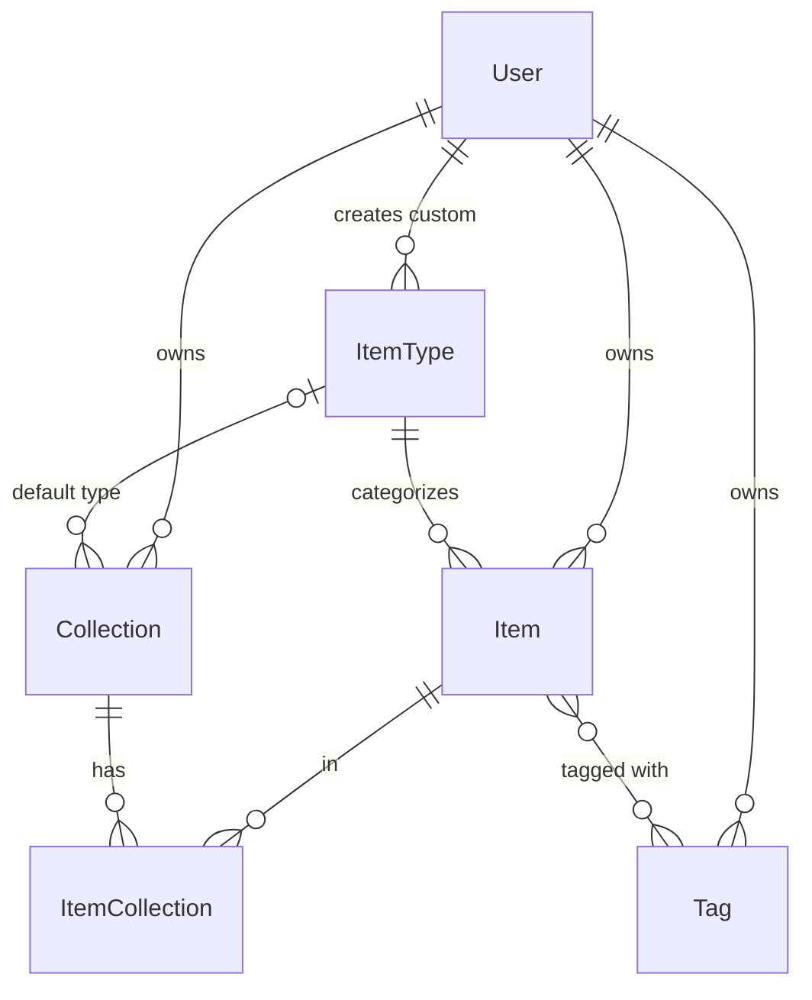
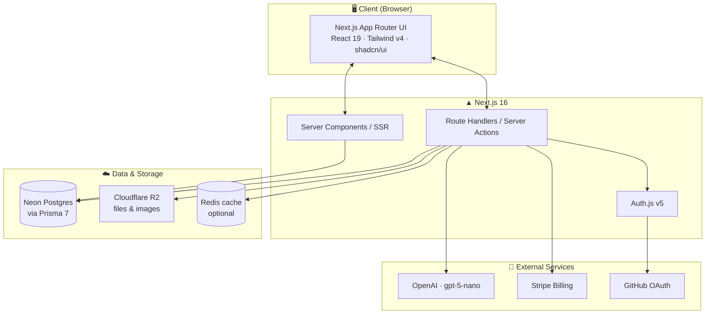

# 📦 DevStash — Project Overview

> **One fast, searchable, AI-enhanced hub for all your dev knowledge & resources.**
> Snippets, prompts, notes, commands, files, images, and links — organized in one place instead of scattered across VS Code, Notion, chats, gists, and bash history.

---

## 🎯 Problem

Developers keep their essentials scattered everywhere:

- 🧩 Code snippets in VS Code or Notion
- 🤖 AI prompts in chat histories
- 📄 Context files buried in projects
- 🔖 Useful links in bookmarks
- 📚 Docs in random folders
- ⌨️ Commands in `.txt` files or bash history
- 🏗️ Project templates in GitHub gists

This causes **context switching**, **lost knowledge**, and **inconsistent workflows**. DevStash centralizes all of it into a single, fast, searchable, AI-enhanced hub.

---

## 👤 Target Users

| Persona | Needs |
|---|---|
| **Everyday Developer** | Fast way to grab snippets, prompts, commands, links |
| **AI-first Developer** | Save prompts, contexts, workflows, system messages |
| **Content Creator / Educator** | Store code blocks, explanations, course notes |
| **Full-stack Builder** | Collect patterns, boilerplates, API examples |

---

## ✨ Features

### A. Items & Item Types
Items have a **type**. Users can create custom types (Pro, later), but these **system types** ship first and are immutable:

| Type | Storage kind | Tier |
|---|---|---|
| `snippet` | text | Free |
| `prompt` | text | Free |
| `note` | text | Free |
| `command` | text | Free |
| `link` | url | Free |
| `file` | file | **Pro** |
| `image` | file | **Pro** |

- A type resolves to one of three storage kinds: **text**, **url**, or **file**.
- Items are quick to create and open inside a **drawer**.
- Routing convention: `/items/snippets`, `/items/prompts`, etc.

### B. Collections
- Users create **collections** that can hold items of **any type**.
- An item can belong to **multiple collections** (e.g. a React snippet in both *React Patterns* and *Interview Prep*).
- Examples: *React Patterns*, *Context Files*, *Python Snippets*.

### C. Search
Powerful search across **content**, **tags**, **titles**, and **types**.

### D. Authentication
Email/password **or** GitHub sign-in (Auth.js v5).

### E. Quality-of-life
- ⭐ Favorite collections and items
- 📌 Pin items to top
- 🕘 Recently used
- 📥 Import code from a file
- ✍️ Markdown editor for text types
- 📤 File upload for `file` / `image` types
- 📦 Export data in multiple formats
- 🌙 Dark mode (default for devs)
- 🔀 Add/remove items across multiple collections + view an item's collections

### F. AI Features — 💎 Pro only
- 🏷️ AI auto-tag suggestions
- 📝 AI summaries
- 💡 "Explain this code"
- ⚡ Prompt optimizer

---

## 🧱 Data Model

### Entity relationships



### Prisma schema

> ⚠️ **Validate against the Prisma 7 docs before running** — schema syntax may differ from earlier versions. `Account` / `Session` / `VerificationToken` follow the **Auth.js Prisma adapter** shape.
> 🚫 **Never use `prisma db push`** or edit the DB directly. Always create migrations, run them in dev, then promote to prod.

```prisma
// schema.prisma — DevStash

generator client {
  provider = "prisma-client-js"
}

datasource db {
  provider = "postgresql"
  url      = env("DATABASE_URL") // Neon
}

// ─── Enums ─────────────────────────────────────────────
enum ContentType {
  TEXT
  FILE
  URL
}

// ─── Auth (Auth.js v5) ─────────────────────────────────
model User {
  id                   String       @id @default(cuid())
  name                 String?
  email                String?      @unique
  emailVerified        DateTime?
  image                String?

  // Billing
  isPro                Boolean      @default(false)
  stripeCustomerId     String?      @unique
  stripeSubscriptionId String?      @unique

  accounts             Account[]
  sessions             Session[]
  items                Item[]
  itemTypes            ItemType[]
  collections          Collection[]
  tags                 Tag[]

  createdAt            DateTime     @default(now())
  updatedAt            DateTime     @updatedAt
}

model Account {
  userId            String
  type              String
  provider          String
  providerAccountId String
  refresh_token     String?
  access_token      String?
  expires_at        Int?
  token_type        String?
  scope             String?
  id_token          String?
  session_state     String?
  user              User    @relation(fields: [userId], references: [id], onDelete: Cascade)

  @@id([provider, providerAccountId])
}

model Session {
  sessionToken String   @unique
  userId       String
  expires      DateTime
  user         User     @relation(fields: [userId], references: [id], onDelete: Cascade)
}

model VerificationToken {
  identifier String
  token      String
  expires    DateTime

  @@id([identifier, token])
}

// ─── Core domain ───────────────────────────────────────
model Item {
  id          String           @id @default(cuid())
  title       String
  contentType ContentType      @default(TEXT)
  content     String?          // text content (null for file/url)
  fileUrl     String?          // Cloudflare R2 URL
  fileName    String?          // original filename
  fileSize    Int?             // bytes
  url         String?          // for link types
  description String?
  language    String?          // optional, for code snippets
  isFavorite  Boolean          @default(false)
  isPinned    Boolean          @default(false)

  userId      String
  user        User             @relation(fields: [userId], references: [id], onDelete: Cascade)
  itemTypeId  String
  itemType    ItemType         @relation(fields: [itemTypeId], references: [id])

  tags        Tag[]
  collections ItemCollection[]

  createdAt   DateTime         @default(now())
  updatedAt   DateTime         @updatedAt

  @@index([userId])
  @@index([itemTypeId])
}

model ItemType {
  id       String  @id @default(cuid())
  name     String
  icon     String  // Lucide icon name
  color    String  // hex, e.g. "#3b82f6"
  isSystem Boolean @default(false)

  userId   String? // null for system types
  user     User?   @relation(fields: [userId], references: [id], onDelete: Cascade)

  items                 Item[]
  defaultForCollections Collection[] @relation("CollectionDefaultType")

  @@index([userId])
}

model Collection {
  id          String           @id @default(cuid())
  name        String
  description String?
  isFavorite  Boolean          @default(false)

  defaultTypeId String?
  defaultType   ItemType?      @relation("CollectionDefaultType", fields: [defaultTypeId], references: [id])

  userId      String
  user        User             @relation(fields: [userId], references: [id], onDelete: Cascade)

  items       ItemCollection[]

  createdAt   DateTime         @default(now())
  updatedAt   DateTime         @updatedAt

  @@index([userId])
}

// Join table: items <-> collections (many-to-many)
model ItemCollection {
  itemId       String
  item         Item       @relation(fields: [itemId], references: [id], onDelete: Cascade)
  collectionId String
  collection   Collection @relation(fields: [collectionId], references: [id], onDelete: Cascade)
  addedAt      DateTime   @default(now())

  @@id([itemId, collectionId])
  @@index([collectionId])
}

model Tag {
  id     String  @id @default(cuid())
  name   String
  userId String?
  user   User?   @relation(fields: [userId], references: [id], onDelete: Cascade)
  items  Item[]

  @@unique([name, userId]) // tags scoped per user
}
```

> 🔧 **Refinements from the raw notes:** `ContentType` includes `URL` (in addition to `text`/`file`) so links model cleanly; `Tag` is scoped per user with a uniqueness constraint. Adjust as the design firms up.

---

## 🏗️ Architecture



---

## 🧰 Tech Stack

| Layer | Choice | Notes |
|---|---|---|
| Framework | [Next.js 16](https://nextjs.org) / [React 19](https://react.dev) | App Router, SSR + dynamic components, route handlers |
| Language | [TypeScript](https://www.typescriptlang.org) | End-to-end type safety |
| Database | [Neon](https://neon.tech) — [PostgreSQL](https://www.postgresql.org) | Serverless Postgres in the cloud |
| ORM | [Prisma 7](https://www.prisma.io) | ⚠️ Migrations only — never `db push` |
| Cache | [Redis](https://redis.io) | Optional / maybe |
| File storage | [Cloudflare R2](https://developers.cloudflare.com/r2/) | Uploads for `file` / `image` items |
| Auth | [Auth.js v5](https://authjs.dev) | Email/password + GitHub OAuth |
| AI | [OpenAI](https://platform.openai.com) `gpt-5-nano` | Tagging, summaries, explain, prompt optimizer |
| Styling | [Tailwind CSS v4](https://tailwindcss.com) + [shadcn/ui](https://ui.shadcn.com) | |
| Icons | [Lucide](https://lucide.dev) | Per-type icons |
| Billing | [Stripe](https://stripe.com) | Freemium subscriptions |

**Architecture principle:** one codebase / one repo for minimal overhead.

---

## 🎨 UI/UX

**Vibe:** modern, minimal, developer-focused. Dark mode by default, light optional. Clean typography, generous whitespace, subtle borders/shadows, syntax highlighting for code blocks.
**References:** [Notion](https://notion.so) · [Linear](https://linear.app) · [Raycast](https://raycast.com)

## Screenshots

Refer to the screenshots below as a base for the dashboard UI. It does not have to be exact. Use it as a reference:

- @context/screnshots/dashboard-ui-main.png
- @context/screnshots/dashboard-ui-drawer.png


### Layout
- **Sidebar + main content** (collapsible sidebar).
- **Sidebar:** item types linking to item lists (Snippets, Commands, …) + latest collections.
- **Main:** grid of **color-coded collection cards** (background color = dominant item type). Items render as cards with a **color-coded border**.
- **Items** open in a quick-access **drawer**.
- **Responsive:** desktop-first, mobile usable; sidebar becomes a drawer on mobile.

### Type colors & icons

| Type | Lucide icon | Color | Swatch |
|---|---|---|---|
| Snippet | `Code` | `#3b82f6` | 🔵 blue |
| Prompt | `Sparkles` | `#8b5cf6` | 🟣 purple |
| Command | `Terminal` | `#f97316` | 🟠 orange |
| Note | `StickyNote` | `#fde047` | 🟡 yellow |
| File | `File` | `#6b7280` | ⚪ gray |
| Image | `Image` | `#ec4899` | 💗 pink |
| Link | `Link` | `#10b981` | 🟢 emerald |

### Micro-interactions
Smooth transitions · hover states on cards · toast notifications · loading skeletons.

---

## 💰 Monetization — Freemium

| | 🆓 Free | 💎 Pro — **$8/mo** or **$72/yr** |
|---|---|---|
| Items | 50 total | Unlimited |
| Collections | 3 | Unlimited |
| System types | All except file/image | All |
| File & image uploads | ❌ | ✅ |
| Custom types | ❌ | ✅ *(later)* |
| Search | Basic | Basic |
| AI (auto-tag, explain, prompt optimizer) | ❌ | ✅ |
| Export (JSON/ZIP) | ❌ | ✅ |
| Support | — | Priority |

> 🛠️ **During development, all users can access everything.** Build the Pro/billing foundation now, but gate features later.

---

## 📌 Key Engineering Rules

- 🚫 **No `prisma db push`** — always create and run **migrations** (dev → prod).
- 🧪 Keep Pro gating behind a flag so dev stays fully unlocked.
- 📚 This Next.js/Prisma version may differ from training data — **check `node_modules/next/dist/docs/` and the Prisma 7 docs** before using unfamiliar APIs.
