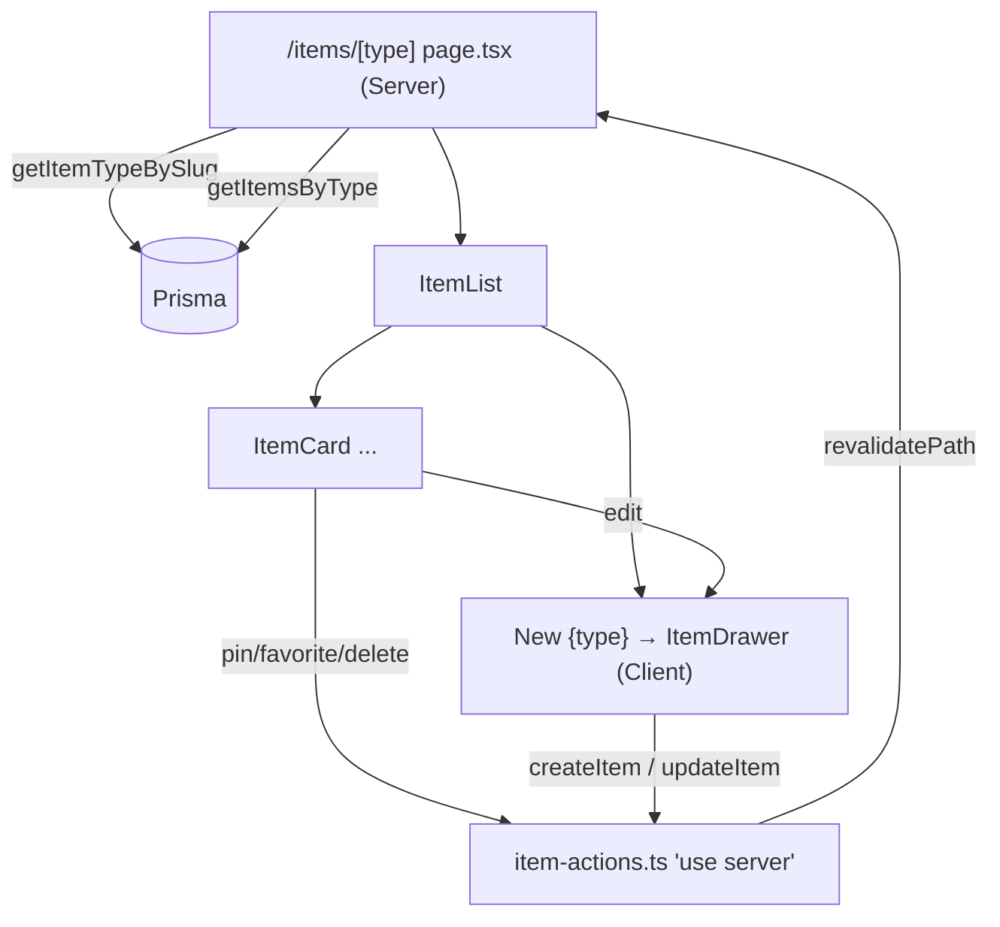

# Item CRUD Architecture

A unified create/read/update/delete design that serves all **7 item types** (snippet, prompt,
note, command, link, file, image) through **one mutation action file**, **one query module**,
**one dynamic route**, and **shared components that adapt by type**. Type differences are handled
in the UI layer — the data/mutation layers stay type-agnostic.

> **Status:** design proposal. As of writing, none of the `/items/[type]` route, `item-actions.ts`,
> or item form components exist yet; the query layer ([src/lib/db/items.ts](../src/lib/db/items.ts))
> and the sidebar link to `/items/{slug}` ([AppSidebar.tsx](../src/components/dashboard/AppSidebar.tsx))
> do. This doc reflects the repo's existing conventions ([coding-standards.md](../context/coding-standards.md),
> [item-types.md](./item-types.md), [schema.prisma](../prisma/schema.prisma)).
>
> **Source notes:** the prompt referenced `docs/content-types.md` (actual file: [item-types.md](./item-types.md))
> and `src/lib/constants.tsx` (does not exist — type icon/color/name come from the DB, seeded by
> [prisma/seed.ts](../prisma/seed.ts)).

## Design principles (from existing conventions)

- **Server Components fetch directly** via `src/lib/db/*` (Prisma) — no API round-trip.
- **Client Components mutate via Server Actions** in a single `src/lib/item-actions.ts` (mirrors
  [profile-actions.ts](../src/lib/profile-actions.ts) / [auth-actions.ts](../src/lib/auth-actions.ts)).
- **One dynamic route** `/items/[type]`; **shared components** branch on the type's `ContentType`.
- **Type-specific logic lives in components, not actions** — the mutation layer persists whatever
  fields are valid for the item's `ContentType`; the form decides which fields to show.
- Actions return the repo's `{ success, data?, error? }` shape, `auth()`-scope every mutation to
  `session.user.id`, validate at the boundary (manual `typeof`/regex — Zod not in use), and
  `revalidatePath` after writing.

## File structure

```
src/
  app/
    items/
      [type]/
        page.tsx              # Server Component: validate type → fetch items → render list + "New" trigger
  lib/
    db/
      items.ts                # QUERIES (existing) — add getItemTypeBySlug(), getItemsByType(), getItemById()
    item-actions.ts           # MUTATIONS (new) — createItem / updateItem / deleteItem / togglePin / toggleFavorite
  components/
    items/
      ItemList.tsx            # grid of cards + empty state + "New {type}" button
      ItemCard.tsx            # display card + row actions  (reuse dashboard/ItemCard shape)
      ItemDrawer.tsx          # client: create/edit drawer, useActionState over create/update
      ItemForm.tsx            # client: shared fields (title, description, tags) + a type-specific field group
      DeleteItemDialog.tsx    # client: confirm delete (shadcn alert-dialog, as DeleteAccountDialog does)
      fields/
        TextItemFields.tsx    # content (+ language) → snippet, prompt, note, command
        LinkItemFields.tsx    # url                  → link
        FileItemFields.tsx    # upload (fileUrl/name/size) → file, image  (Pro)
```

Rationale: queries stay in `lib/db` (called from Server Components), mutations collapse into one
`item-actions.ts`, and everything type-specific is a small field component selected by content kind.

## How `/items/[type]` routing works

1. **Route:** `src/app/items/[type]/page.tsx`, an `async` Server Component, `export const dynamic = "force-dynamic"` (reads the DB per request, like the dashboard).
2. **Param:** `params.type` is the **slug** = the lowercased system-type name (`snippet`, `prompt`, …),
   matching `getSidebarItemTypes().slug` in [items.ts](../src/lib/db/items.ts). Use the **singular**
   DB name (project-overview's plural `/items/snippets` is outdated).
3. **Validate:** resolve the slug via a new `getItemTypeBySlug(slug)`; if it doesn't match a system
   type, call `notFound()`.
4. **Fetch:** `getItemsByType(slug)` returns the type's items (reusing the existing `itemCardSelect`
   + `toItemSummary` mapper pattern). Optionally scope to `session.user.id`.
5. **Render:** a header (type name + `TypeIcon` in the type color), `<ItemList>`, and a
   **"New {type}"** button that opens `<ItemDrawer mode="create" type={…}>`.



## Where type-specific logic lives (components, not actions)

The type's **`ContentType`** (`TEXT` | `URL` | `FILE`, see [item-types.md](./item-types.md)) selects a
**field group** inside `ItemForm` — this is the *only* place types diverge:

| Content kind | Types | Field group | Persisted fields |
|--------------|-------|-------------|------------------|
| `TEXT` | snippet, prompt, note, command | `TextItemFields` | `content` (+ `language` for snippet/command) |
| `URL` | link | `LinkItemFields` | `url` |
| `FILE` | file, image *(Pro)* | `FileItemFields` | `fileUrl`, `fileName`, `fileSize` |

`item-actions.ts` stays **generic**: it accepts one payload (`itemTypeId` + optional
`content`/`language`/`url`/`file*` + shared `title`/`description`/`tags`), looks up the type's
`ContentType`, and **persists only the fields valid for that kind** (nulling the rest). No `switch`
per type in the action — add a new custom type and only a field-group mapping changes.

## Component responsibilities

- **`app/items/[type]/page.tsx`** *(server)* — validate slug (`notFound()` on miss), fetch the
  type + its items directly from `lib/db`, render header + list + create trigger.
- **`ItemList`** — lay out `ItemCard`s, show an empty state, host the "New {type}" button.
- **`ItemCard`** — display (icon/color/accent from the item's type via `TypeIcon`; guards null
  description/empty tags — reuse [dashboard/ItemCard](../src/components/dashboard/ItemCard.tsx)); row
  actions (edit → drawer; pin/favorite/delete → actions).
- **`ItemDrawer`** *(client)* — create/edit shell; drives `createItem`/`updateItem` with
  `useActionState`; shows the returned `error`; closes + lets the route revalidate on success.
- **`ItemForm`** *(client)* — renders shared fields (title, description, tags) + the one
  type-specific `fields/*` group chosen by content kind; client-side required checks.
- **`fields/TextItemFields` · `LinkItemFields` · `FileItemFields`** *(client)* — the per-kind inputs;
  `FileItemFields` is **Pro-gated** (file/image).
- **`DeleteItemDialog`** *(client)* — confirm → `deleteItem` (pattern from
  [DeleteAccountDialog](../src/components/profile/DeleteAccountDialog.tsx)).

## `item-actions.ts` contract (proposed)

```ts
"use server";
// Every action: auth() → 401 if no session; scope by session.user.id (ownership);
// validate at the boundary; persist per the type's ContentType; revalidatePath("/items/[type]").

type ItemInput = {
  itemTypeId: string;
  title: string;
  description?: string;
  tags?: string[];
  content?: string;   // TEXT
  language?: string;  // TEXT (snippet/command)
  url?: string;       // URL
  fileUrl?: string; fileName?: string; fileSize?: number; // FILE (Pro)
};

createItem(input: ItemInput): Promise<{ success: boolean; id?: string; error?: string }>;
updateItem(id: string, input: Partial<ItemInput>): Promise<{ success: boolean; error?: string }>;
deleteItem(id: string): Promise<{ success: boolean; error?: string }>;
togglePin(id: string): Promise<{ success: boolean; error?: string }>;
toggleFavorite(id: string): Promise<{ success: boolean; error?: string }>;
```

Ownership (`where: { id, userId: session.user.id }`) prevents IDOR; the same generic path handles
all seven types (and future custom ones).
